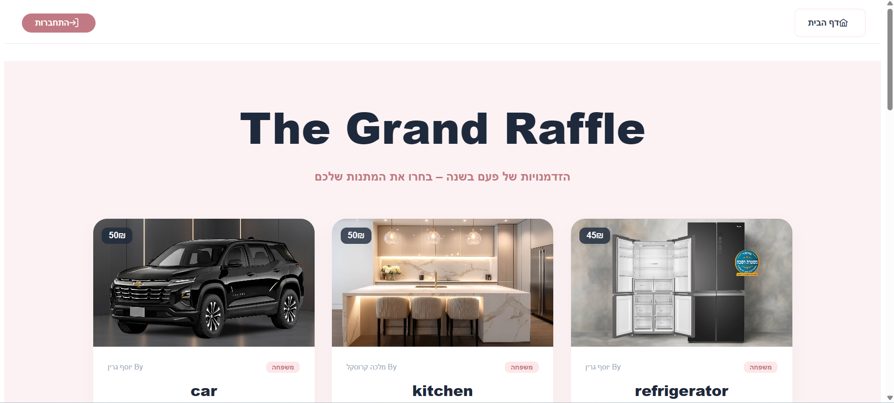
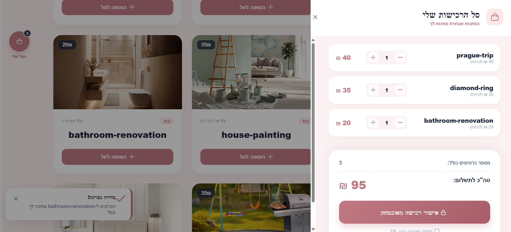
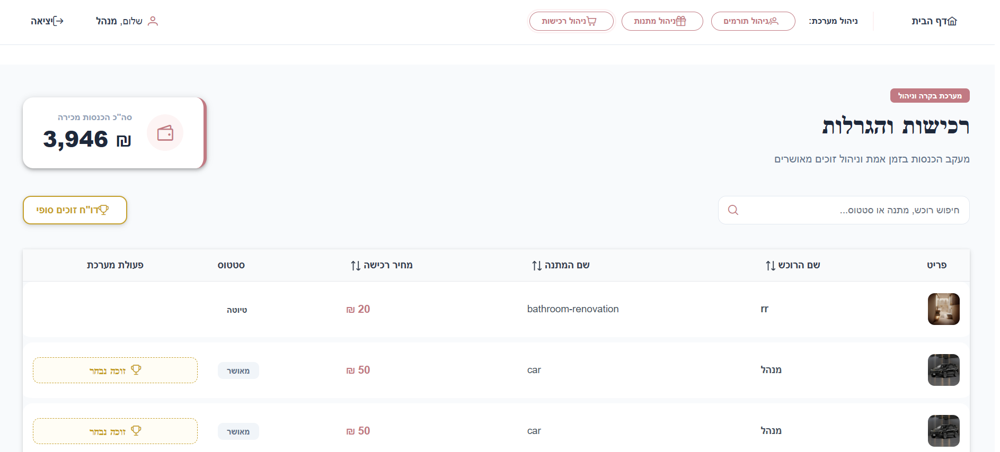
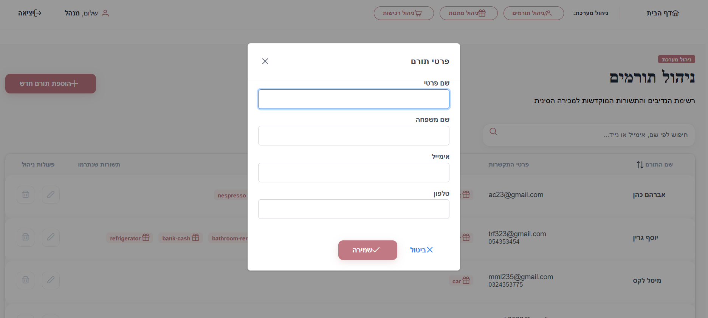

# 🎟️ Charity Auction Platform

A full-stack charity auction management system built with Angular 17, .NET 8, and SQL Server. The platform enables ticket purchasing, donor and gift management, administrative dashboard monitoring, automated winner selection, and secure JWT-based authentication through a clean multi-layered architecture.

---


---

## 🛠️ Tech Stack & Architecture

### Backend
- **Framework:** C# / .NET 8 Web API
- **Architecture:** Layered Architecture (Controllers, BL, DAL)
- **Database:** SQL Server
- **ORM:** Entity Framework Core (Code First)
- **Authentication & Security:** JWT Authentication, Role-Based Authorization, BCrypt Password Hashing

### Frontend
- **Framework:** Angular 17 + TypeScript
- **UI Components:** PrimeNG, PrimeFlex, PrimeIcons
- **Forms & Validation:** Reactive Forms
- **State Management & Async:** RxJS
- **Routing & Security:** Route Guards, HTTP Interceptors
- **Styling:** Tailwind CSS
---
---

## 🌟 Highlights

- ⚡ Built with Angular 17 and .NET 8
- 🔐 JWT Authentication & Role-Based Authorization
- 🗄️ SQL Server with Entity Framework Core
- 🏗️ Clean Multi-Layer Architecture (Controllers, BL, DAL)
- 📊 Administrative Dashboard
- 🎟️ Ticket Purchase & Auction Management
- 🏆 Automated Winner Selection
---

## 🚀 Getting Started

### Clone the Repository

```bash
git clone https://github.com/tr535/charity-auction-platform.git
cd charity-auction-platform
```

### Run the Frontend

```bash
cd angular
npm install
ng serve
```

Frontend URL:

```text
http://localhost:4200
```

### Run the Backend

1. Open the solution in Visual Studio.
2. Configure the SQL Server connection string in `appsettings.json`.
3. Apply Entity Framework migrations.
4. Run the API project.

Backend URL:

```text
https://localhost:5001
```
> Make sure SQL Server is running before starting the API.

## ✨ Main Features

* 🎟️ Ticket Purchase & Checkout System
* 🎁 Donor & Gift Management
* 🔐 JWT Authentication & Authorization
* 👥 Protected Admin Panel
* 🏆 Automated Winner Selection
* 📊 Revenue & Winners Dashboard
* 📱 Fully Responsive UI
* ⚡ Angular Reactive Forms & Validation


## 📸 Screenshots

### 🏠 Home Page & Purchase Experience
<p align="center">
  
</p>
<br><br>

### 🛒 Shopping Cart & Checkout
<p align="center">
  
</p>
<br><br>

---

### ⚙️ Admin Panel
<details>
  <summary><b>View Administrative Dashboard & Management Screens 📊</b></summary>  <br><br>
  
  <p align="center">
<b>📊 Revenue & Winners Dashboard</b>    <br><br>
    
  </p>
  
  <br><br>
  <br><br>
  
  <p align="center">
<b>🎁 Donor & Gift Management Form</b>    <br><br>
    
  </p>
  <br><br>
</details>


## 🏗️ Architecture

The application follows a clean multi-layered architecture:

```text
Angular Frontend
       │
       ▼
.NET 8 Web API
       │
       ▼
BL (Business Logic)
       │
       ▼
DAL (Data Access Layer)
       │
       ▼
SQL Server Database
```

This layered structure separates presentation, business logic, and data access responsibilities, making the application easier to maintain and extend.
---

## 📂 Project Structure

```text
Frontend (Angular)
├── Components
├── Services
├── Guards
├── Interceptors
└── Models

Backend (.NET 8)
├── Controllers
├── Business Logic (BL)
├── Data Access Layer (DAL)
├── Models
├── Middlewares
└── Database Migrations
```


---

## 🔐 Testing Credentials

The application includes a pre-configured administrator account for testing and evaluation:

* **Email:** `m@m.com`
* **Password:** `admin123`
